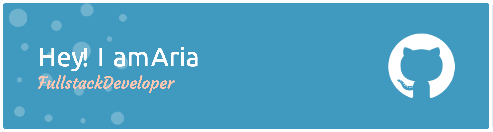

#### 👩‍💻 About Me

- 🎓 M.S. in Computer Science, University of the Pacific
- 🎓 M.S. in Statistics, B.S. in Finance, University of Science and Technology of China
- 💼 Currently Full Stack Engineer at [We Independent](https://weindependent.org)
- 💡 Passionate about software development, clean code, and system design  
- 🌱 Actively working on React, Node.js
- 📌 I'm actively looking for full-time Software Engineer opportunities in the U.S. 
  
---

#### 🛠 Tech Stack

##### 💻 Languages

  

##### 🌐 Frontend

  

##### 🔧 Backend & DevOps

  

##### ☁️ Cloud & Databases

  

##### 🎮 Others

  

---

#### 🧸 Connect with Me

  
  
  
  
  
  

---

  💖 Thanks for stopping by! 🐳 Let's build something amazing! 
  

